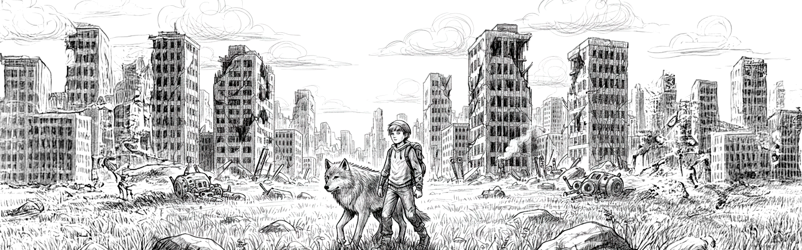

# BAD BOTS
### Projeto Open Source Colaborativo

---
## Sobre o Projeto
**Bad Bots** é um jogo open source em desenvolvimento na **Unreal Engine 5**. Em um futuro distópico, a humanidade é ameaçada por robôs dominados por uma IA. A sua única esperança é lutar ao lado da natureza, domando animais como lobos, leões e falcões para vencer a guerra contra as máquinas.

A inspiração do jogo vem de títulos aclamados como **Horizon Zero Dawn**, combinando exploração e combate com a mecânica de domar animais vista em **Ark Survivor**. Além disso, a experiência será expandida com mini-games mobile, que permitirão aos jogadores aumentar seu exército de animais e desbloquear itens especiais.

---
## Oportunidades de Colaboração
Estamos na fase de concepção e montando o núcleo fundador do projeto. Se você é um profissional com experiência e paixão por jogos, gostaríamos de contar com seu conhecimento para moldar a estrutura, o roteiro e o futuro do **Bad Bots** desde a base.

---
### Buscamos as seguintes Especializações:

| Área                  | Responsabilidades                                  | Status      |
| :-------------------- | :------------------------------------------------- | :---------- |
| **Game Design** | Definição de mecânicas, regras e roadmap           | Aberto      |
| **UI/UX** | Criação da interface e experiência do usuário      | Aberto      |
| **Marketing** | Estratégia de comunidade e divulgação do projeto   | Aberto      |
| **Arte 3D / Concept** | Criação de modelos, cenários e personagens         | Aberto      |
| **Roteiro & Narrativa** | Desenvolvimento da história e lore do universo   | Aberto      |

**Interessado em fazer parte?** Envie um email para **email@email.com** com seu portfólio ou perfil profissional.

---
### Núcleo Fundador

| Nome             | Função           | Contato             |
| :--------------- | :--------------- | :------------------ |
| Juan Diego       | CEO & Fundador   | @Juan_Morfos        |
| Sohil            | Soluções de Dados| @Sohil_Profile      |
| Carlos Alberto   | Designer & Co Fundador        | @solrack02          |
